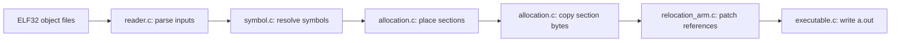

# Linker — ARM32 ELF Linker in C

A small static-linker prototype that reads ELF32 relocatable object files, resolves symbols across inputs, lays out allocatable sections, applies a limited set of ARM relocations, and writes an ELF executable image.

The implementation exposes the mechanics of linking through separate parsing, symbol-resolution, allocation, relocation, and output modules. It is an educational systems-programming project with known correctness limitations, rather than a replacement for a production linker.

## Features

- Reads ELF headers, section headers, section-name tables, and symbol tables, with diagnostic output.
- Collects external symbols across multiple objects, resolves references, gives strong definitions precedence over weak definitions, and rejects duplicate strong definitions.
- Combines supported allocatable sections into `.text`, `.rodata`, `.data`, and `.bss` buckets while respecting input alignment.
- Copies file-backed section bytes into output buffers; represents `.bss` as memory without corresponding file bytes.
- Processes `SHT_REL` relocation sections with handling for `R_ARM_CALL` and `R_ARM_NONE`.
- Writes an ARM ELF32 executable with one loadable segment, choosing `_start` as the entry symbol or falling back to `main`.

## Architecture



`reader.c` orchestrates the passes. The symbol table records each definition's input object and section-relative value. Allocation records where each input section resides in its output bucket. Relocation and entry-point selection combine those mappings to calculate final addresses.

See [docs/ARCHITECTURE.md](docs/ARCHITECTURE.md) for the data structures, resolution rules, and output format.

## Technologies and requirements

- C and the standard C library, plus POSIX `strdup`.
- Linux ELF definitions from `<elf.h>`.
- GCC or another compatible C compiler; GNU binutils `readelf` for inspection.
- ARM32 object files for linking. The linker program itself can be built on a little-endian x86-64 Linux host.
- An ARM cross-compiler is needed only to rebuild the example input objects on a non-ARM host.

There are no third-party application libraries, package dependencies, or build-system files.

## Project structure

```text
README.md
 docs/ARCHITECTURE.md
 linker/
 ├── reader.c                    # Command-line driver and ELF parsing
 ├── symbol.c / symbol.h         # Global symbol collection and resolution
 ├── allocation.c / allocation.h # Section layout and output buffers
 ├── relocation_arm.c / relocation.h # ARM relocation processing
 ├── executable.c / executable.h # ELF executable writer
 ├── foo.c / main.c              # Cross-object function-call example
 ├── foo.o / main.o              # Supplied ARM32 relocatable objects
 ├── hello.c / hello.o / hello   # Separate hello-world example and artifacts
 ├── reader / a.out              # Previously committed build artifacts
 └── README.md                   # Link to this guide
```

The implementation directory is named `linker`. Build into a separate directory to avoid overwriting the committed binaries and object files.

## Build and usage

From the repository root on Linux:

```bash
mkdir -p build
gcc -Wall -Wextra linker/reader.c linker/symbol.c linker/allocation.c \
    linker/relocation_arm.c linker/executable.c -o build/reader
cd build
./reader ../linker/foo.o ../linker/main.o
readelf -h -l a.out
```

The linker always writes `a.out` in its current working directory; it has no `-o` option. It emits detailed header, section, symbol, and relocation diagnostics before the final output message.

The included `foo.o` and `main.o` are ARM32 ELF objects. The included `hello.o` is an x86-64 ELF64 object and is not a supported input. Rebuild the linker from source rather than relying on the committed `reader` binary.

### Rebuilding the ARM examples

With an ARM GNU/Linux cross-compiler installed, the following commands produce ARM-mode objects without linking or generating unwind tables:

```bash
arm-linux-gnueabi-gcc -marm -fno-pic -fno-pie \
    -fno-unwind-tables -fno-asynchronous-unwind-tables \
    -c linker/foo.c -o build/foo.o
arm-linux-gnueabi-gcc -marm -fno-pic -fno-pie \
    -fno-unwind-tables -fno-asynchronous-unwind-tables \
    -c linker/main.c -o build/main.o
cd build
./reader foo.o main.o
readelf -h -l a.out
```

These cross-compilation commands were not run during documentation review because the cross-compiler was unavailable. Inspect generated relocations with `readelf -r build/main.o`: compiler defaults can produce relocation types or sections the prototype does not support.

## Example behavior and validation

`main.c` calls `foo()`, whose definition returns `42`. Linking the supplied objects demonstrates cross-object symbol resolution and patches one `R_ARM_CALL` reference. The tool reports:

```text
All symbols resolved
All relocations applied (text=52 rodata=0 data=0)
Wrote executable: a.out (entry=0x0040001c)
```

During documentation review:

- The source compiled with GCC 14.2.0 on Linux, with existing format-string and unused-variable warnings.
- Linking the supplied ARM objects completed, and `readelf` identified an ELF32 ARM executable with one read/write/execute load segment.
- Linking `main.o` alone returned status `1` and reported the unresolved `foo` symbol.
- Independent decoding of the patched branch revealed a correctness defect: its target is `0x003ffff8`, eight bytes before `foo` at `0x00400000`.

Successful file generation therefore does **not** establish correct execution. The output was not executed, and no automated test suite is included.

## Implementation decisions

- **Multiple explicit passes:** symbol resolution precedes allocation; final addresses are assigned before relocation and executable writing.
- **Shared placement metadata:** each input section maps to a bucket and offset, avoiding separate address calculations for every module.
- **Simple symbol table:** a growable array with linear name lookup keeps the implementation straightforward, at the cost of scalability.
- **Fixed output layout:** file content starts at `0x1000`, virtual addresses at `0x400000`, and all supported buckets share one load segment.
- **Minimal executable metadata:** output includes ELF and program headers, but no section-header table or output symbol table.
